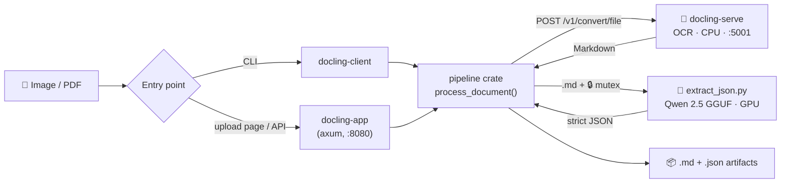

# 📄 docs-to-md

<!-- Language / backend -->


<!-- ML / inference -->


<!-- OCR / runtime -->


<!-- Posture -->


Air-gapped document extraction: passports, ID cards, and technical manuals in — structured JSON out, with **zero cloud calls**. A shared Rust pipeline ships files to a local `docling-serve` OCR container (CPU), then a quantized Qwen 2.5 GGUF model (GPU) turns the OCR Markdown into strict JSON. Use it from the CLI or a self-hostable axum web app; no PII ever leaves your machine.

## 🔀 Pipeline



CPU handles OCR, GPU handles LLM inference — a deliberate split that keeps a 3.5 GB-VRAM card (GTX 970) from OOM-ing. Full rationale in [docs/ARCHITECTURE.md](docs/ARCHITECTURE.md).

## 🚀 Quickstart

**1. Start the OCR engine** (Docker):
```powershell
docker run -d --name docling-serve -p 5001:5001 `
  -e OMP_NUM_THREADS=4 -e MKL_NUM_THREADS=4 `
  ghcr.io/docling-project/docling-serve
```

**2. Set up the Python sidecar:**
```powershell
python -m venv .venv
.\.venv\Scripts\Activate.ps1
pip install -r requirements.txt                # CPU-only
# or, with NVIDIA GPU acceleration (prebuilt CUDA 12.4 wheel):
pip install llama-cpp-python --extra-index-url https://abetlen.github.io/llama-cpp-python/whl/cu124
```

**3. Download the model** (~1 GB, not tracked in git):
```powershell
curl -L -o qwen2.5-1.5b-instruct-q4_k_m.gguf `
  https://huggingface.co/Qwen/Qwen2.5-1.5B-Instruct-GGUF/resolve/main/qwen2.5-1.5b-instruct-q4_k_m.gguf
```

**4. Run** (from the repo root):
```powershell
# CLI — one-shot extraction:
cargo run -p docling-client -- samples/Croatian_passport_data_page.jpg

# Web app — upload page + JSON API on http://127.0.0.1:8080
cargo run -p docling-app
```

```powershell
# API example:
curl -F "file=@samples/Passport_of_Serbia_ID_2009_version.jpg" http://127.0.0.1:8080/api/extract
```

> **Windows note:** the pre-compiled CUDA `llama-cpp-python` bindings require the Microsoft Visual C++ Redistributable.

## 📁 Repository Layout

```
├── pipeline/         Shared Rust library: process_document() — OCR → md → LLM → JSON
├── docling-client/   CLI front-end (thin wrapper)
├── docling-app/      axum web app: upload page + POST /api/extract (thin wrapper)
├── extract_json.py   Python sidecar: Qwen 2.5 GGUF → structured JSON
├── requirements.txt  Sidecar dependencies
├── samples/          Public-domain specimen documents + example outputs
└── docs/             Architectural manifest & roadmap
```

## 🔒 Security

Everything runs on loopback; the web app binds `127.0.0.1` by default and ships **without authentication**. If you expose it (`BIND_ADDR=0.0.0.0:8080`), put a reverse proxy with TLS + auth in front — it processes identity documents. Uploaded files and intermediate artifacts are deleted after each request. Details and the v0.3.0 roadmap (deterministic ICAO 9303 MRZ validation, payload encryption) live in [docs/ARCHITECTURE.md](docs/ARCHITECTURE.md).
