# 🏛️ Architectural Manifest: multi-level-id-strip (mlis) — Air-Gapped Document Processing (v0.6.0)

## 1. Executive Summary
This repository houses the design and implementation of a localized, air-gapped machine learning architecture dedicated to processing complex identity documents (passports, ID cards) and multipage technical manuals. Engineered for high-stakes rental and compliance applications, the system automates data extraction while enforcing strict data privacy, zero recurring cloud API costs, and optimal local hardware utilization. By decoupling high-concurrency file orchestration from heavy machine learning workloads, the pipeline achieves a robust, production-ready foundation for sensitive Personally Identifiable Information (PII) processing.

As of **v0.6.0**, the LLM fallback tier runs **in-process** — no Python interpreter, no gRPC sidecar, no second container required for the default path. This is the first concrete step on the road to a single static `musl` binary (see [§9](#9-strategic-roadmap-v070--v100-the-road-to-a-single-static-binary)); everything else in this document describes what's true *today*, in this repo, right now.

## 2. Architectural Foundation: Two-Tier Extraction Behind a Pluggable Inference Seam
The system is a **Rust-first pipeline with a deliberately narrow, swappable boundary** where probabilistic inference happens — everything else is deterministic Rust:

* **Deterministic MRZ Core (`mrz` crate, zero deps):** ICAO 9303 TD1/TD2/TD3 parsing with full 7-3-1 check-digit validation and checksum-verified OCR repair. Zero runtime dependencies, so the identical code compiles natively for the pipeline and to WebAssembly for the public browser demo.
* **Pipeline Core (`mlis-pipeline` crate):** Owns the end-to-end sequence — OCR → Markdown persistence → Tier 1 MRZ validation → Tier 2 `InferBackend` fallback → JSON — behind a single `process_document()` entry point. Both binaries are thin wrappers around it. Concurrency control (a single-flight semaphore + an observable queue-depth counter) lives *here*, not in either backend, so the "one concurrent Tier-2 call" invariant holds no matter which backend is active.
* **OCR Engine (pluggable behind a trait):** An `OcrEngine` trait abstracts text extraction. The default `docling-serve` container (Layout Transformers, RapidOCR) runs on every platform; a native `ocr-daemon` engine (Tesseract + Leptonica, DPI normalization, orientation correction, deskew, Otsu binarization) is available in-process on Linux/WSL, selected via `MLIS_OCR_ENGINE`.
* **Inference Engine (pluggable behind a trait — the new part in v0.6.0):** An `InferBackend` trait ([`crates/mlis-pipeline/src/infer.rs`](../crates/mlis-pipeline/src/infer.rs)) abstracts *how* Tier 2 turns OCR Markdown into a structured `Extraction`. Two implementations exist today, selected at runtime via `MLIS_INFERER`:
  * **`NativeInferer`** (feature `inferer-native`, **default**) — the [`mlis-llm`](../crates/mlis-llm/) crate loads the quantized Qwen 2.5 GGUF once via [`llama-cpp-2`](https://crates.io/crates/llama-cpp-2) (Rust bindings to `llama.cpp`), verifies its SHA-256 before first use, and keeps it warm in-process for the life of the CLI or web-server process. No sidecar, no network hop, no second language runtime.
  * **`GrpcInferer`** (feature `inferer-grpc`, still default-enabled this release) — the v0.4.x/v0.5.x design: a persistent Python sidecar (`python/inferer`) keeps the same GGUF warm behind `llama-cpp-python` and answers `Extract`/`ExtractStream`/`Health` RPCs over gRPC (tonic ↔ grpcio). Kept as a fallback for **one release past `NativeInferer` shipping**, primarily for anyone who already has a CUDA-accelerated `llama-cpp-python` install; scheduled for deletion once the pure-Rust OCR milestone lands and the sidecar has no remaining reason to exist.

  Both implementations produce the identical `mlis_core::Extraction` schema, so nothing downstream — the CLI, the web app, the audit log, the encryption layer — knows or cares which one ran. Swapping the default from `grpc` to `native` in v0.6.0 required zero changes to `mlis-cli` beyond the doctor command's health check, and zero changes to `mlis-serve`'s request/response shape.
* **Orchestration Layer (`mlis-cli`, binary `mlis`):** A lightweight asynchronous Rust client handling local file system I/O, CLI argument validation, `mlis doctor` (preflight: OCR + inferer reachability, config sanity), and `mlis decrypt`.
* **Web Front-End (`mlis-serve`, axum):** Exposes the same pipeline as an upload page and a JSON API, with bearer-token auth and optional rustls TLS, and forwards Tier-2 token deltas to the browser over SSE so uploads show live progress instead of a frozen status line.

## 3. Why the Inference Engine Became Pluggable
Through v0.5.x, Tier 2 was hardwired to the gRPC sidecar: correct, but it meant every deployment needed a Python virtualenv (or a second Docker container) purely to keep an LLM warm that Rust is fully capable of running itself. That's a real cost for the target deployment shape — an offline, sellable, single-binary appliance — so v0.6.0 introduces the `InferBackend` trait specifically to let the *default* move to in-process inference without deleting the working gRPC path outright. The trait boundary is intentionally the only place backend choice matters:

```rust
#[async_trait]
pub trait InferBackend: Send + Sync {
    async fn extract(&self, markdown: &str) -> Result<Extraction, String>;
    async fn extract_stream(&self, markdown: &str, tx: &mpsc::Sender<ProcessEvent>) -> Result<Extraction, String>;
    fn describe(&self) -> String;
    async fn health(&self) -> Result<String, String>;
}
```
`NativeInferer::extract` and `extract_stream` run the actual `llama.cpp` generation loop inside `tokio::task::spawn_blocking` (it's CPU-bound, synchronous work — running it on the async executor would stall every other in-flight request), and forward streaming deltas back to the caller with non-blocking `try_send`, so a stalled browser connection can never extend how long the single Tier-2 concurrency permit is held. `LlamaBackend::init()` is a process-wide singleton in `llama.cpp` itself, so the model is loaded lazily on first use (`tokio::sync::OnceCell`) and never re-initialized.

## 4. Hardware Allocation & Performance Strategy
The native backend, as built in this repository, is **CPU-only** — that's a deliberate choice, not a current limitation to apologize for: it's what makes a self-contained musl binary possible at v1.0.0, and it's what lets the appliance target run on hardware with no discrete GPU at all. For deployments that already have GPU headroom and want to keep using it, the legacy gRPC backend still supports the CUDA-accelerated `llama-cpp-python` wheel, with the same OCR/LLM hardware split the project has used since v0.4.0:
1. `docling-serve` is bound to the physical CPU (`OMP_NUM_THREADS`/`MKL_NUM_THREADS`), regardless of which Tier-2 backend is active.
2. When the gRPC backend runs on GPU, that split keeps a small-VRAM card (e.g. GTX 970, 3.5 GB) from OOM-ing, since OCR never competes with the LLM for VRAM.
3. When the native backend runs on CPU, there's no VRAM contention to design around in the first place — inference just costs wall-clock time (~1-2 minutes for a single-document extraction on modest hardware, per the field-accuracy harness runs in CI).

## 5. Pipeline Execution Flow

```mermaid
sequenceDiagram
    autonumber
    actor U as User
    participant B as mlis-cli / mlis-serve
    participant P as mlis-pipeline (Pipeline)
    participant D as 🐳 OCR engine (docling / native)
    participant I as 🧠 InferBackend (native or grpc)

    U->>B: file path / multipart upload
    B->>P: process_document(path)
    P->>D: OcrEngine::to_markdown(file)
    D-->>P: structured Markdown
    P->>P: write <input>.md
    P->>P: Tier 1 — ICAO 9303 MRZ checksum validation (TD1/TD2/TD3)
    alt MRZ composite check digit valid
        P->>P: deterministic JSON (+ country names, date validity), Tier 2 skipped
    else no MRZ / checksums failed
        P->>P: acquire llm_semaphore permit (+ increment queue-depth)
        P->>I: extract(markdown) / extract_stream(markdown, tx)
        alt native (default)
            I->>I: mlis-llm: warm GGUF (llama.cpp, in-process), ChatML prompt, greedy sample
        else grpc (legacy)
            I->>I: Extract RPC to Python sidecar (warm GGUF, Pydantic-validated)
        end
        I-->>P: Extraction (or streamed deltas, then final result)
        P->>P: release permit (- decrement queue-depth)
    end
    P->>P: persist JSON (AES-256-GCM if MLIS_KEY) + PII-free audit record
    P-->>B: PipelineResult { markdown, extracted, mrz, method }
    B-->>U: console output / JSON response (SSE deltas if streaming)
```



### CLI (`mlis-cli`, binary `mlis`)
1. **Ingestion:** the user passes a local image or PDF path to the Rust binary (`cargo run -p mlis-cli -- <file>`).
2. **Validation:** Rust verifies file existence, then hands off to `Pipeline::process_document`, which auto-generates the target `.md` output path.
3. **OCR:** the active `OcrEngine` (docling-serve or the native Tesseract engine) returns structured Markdown.
4. **Persistence:** the Markdown is written to disk.
5. **Tier 2 (if triggered):** the active `InferBackend` — native by default — runs, serialized behind `Pipeline`'s semaphore.
6. **JSON generation:** the backend returns a typed `Extraction`; the pipeline writes a `.json` (or encrypted `.json.enc`) adjacent to the source and appends an audit record.
7. **`mlis doctor`:** preflight — checks OCR reachability, then calls `Pipeline::infer_health()`, which for the native backend confirms the model file exists and SHA-256-verifies it (or reports the skip), and for the gRPC backend confirms the sidecar answers `Health`.

### Web App (`mlis-serve`)
1. **GET /** serves an embedded, dependency-free upload page.
2. **POST /api/extract** accepts a multipart file upload (≤ 20 MB), stores it under an ephemeral `work/` directory, and invokes the same pipeline core — as an SSE stream, so Tier-2 token deltas reach the browser in real time instead of behind a frozen status line.
3. The terminal event bundles both artifacts: `{ "filename", "markdown", "extracted", "method", "mrz", "error" }`. A Tier-2 failure degrades gracefully — the OCR Markdown is still returned alongside the error.
4. **Overload protection:** `MLIS_MAX_QUEUE_DEPTH` (default 4) rejects new uploads with `503` once that many Tier-2 requests are queued/in-flight, instead of accepting them unboundedly and blocking behind the single-flight semaphore.
5. **Auth:** when `MLIS_TOKEN` is set, every request needs `Authorization: Bearer <token>`; a non-loopback `BIND_ADDR` without a token is refused at startup. Optional rustls TLS via `MLIS_TLS_CERT`/`MLIS_TLS_KEY`.
6. **PII hygiene:** working files are deleted after each request (`KEEP_WORK=1` retains them for debugging).
7. Configuration via environment: `BIND_ADDR`, `MLIS_OCR_ENGINE`, `DOCLING_URL`, `MLIS_INFERER`, `MLIS_MODEL_PATH`, `MLIS_INFERER_ADDR`, `MLIS_MAX_QUEUE_DEPTH`, `MLIS_TOKEN`, `MLIS_AUDIT_LOG`, `MLIS_KEY`, `WORK_DIR`.

## 6. Security & Compliance Posture
Designed for environments with stringent regulatory requirements (e.g., GDPR), the pipeline enforces a **Zero-Telemetry, Air-Gapped Posture**:
* **No External Network Calls:** all processing, from OCR to LLM inference, occurs strictly within the local loopback interface (`localhost`) or, for the native backend, entirely inside the same process with no network call at all. No PII ever leaves the host machine.
* **Loopback by Default:** the web app binds to `127.0.0.1` unless explicitly overridden. It ships **without authentication** — if you expose it beyond loopback (`BIND_ADDR=0.0.0.0:8080`), `mlis-serve` refuses to start unless `MLIS_TOKEN` is set. It processes identity documents; treat it accordingly.
* **Model integrity:** the native backend SHA-256-verifies the GGUF against a known-good hash before first use (`MLIS_MODEL_SHA256` to pin a different build, `MLIS_MODEL_SKIP_VERIFY=1` to bypass for local development) — a tampered or substituted model file fails closed instead of silently running.
* **Dependency isolation:** the legacy gRPC backend's Python virtual environment (`.venv`) and Docker containers limit the blast radius of any supply-chain vulnerability in that path; the native backend removes that surface for the default deployment shape entirely.
* **Deterministic-first design:** Tier 1 is tried before Tier 2 on every document specifically because MRZ checksum validation is provably correct where LLM extraction is only probably correct — see [§7](#7-known-limitations--what-tier-2-accuracy-actually-looks-like).

## 7. Known Limitations & What Tier-2 Accuracy Actually Looks Like
The 1.5B model is small enough to run comfortably on CPU, and that comes with a real accuracy ceiling worth stating plainly rather than glossing over. The field-level parity harness (`crates/mlis-llm/tests/parity.rs`, run against real specimen documents in `samples/`) measured a **~45% per-field exact-match rate** against deterministic-MRZ ground truth (date-format normalized) on the current model. It's strong on well-formed front-page passport/ID layouts and materially worse on rear-side ID cards and heavily garbled MRZ blocks — exactly the failure mode Tier 1 exists to route around. The harness asserts a 25%-floor regression guard (catching a broken prompt or a JSON-repair bug), not an accuracy target, and is deliberately not gated at a higher bar: raising the bar is a model/prompt-quality project, not a correctness one, and belongs in a future milestone rather than blocking this one.

## 8. Operational Validation
The pipeline has been tested against real-world specimen documents (public-domain samples in [`../samples/`](../samples/)) spanning Croatian, Serbian, Estonian, Slovenian, and other passports/ID cards.
* **Multilingual handling:** the OCR engine captures complex, multi-lingual layouts across Latin and Cyrillic scripts.
* **Tier 1 coverage:** TD1/TD2/TD3 MRZ formats, with checksum-verified OCR repair correcting common lookalike misreads before validation.
* **Tier 2 coverage:** the native and gRPC backends are verified to produce byte-identical `Extraction` schemas via the shared `mlis-core::Extraction` type; the native backend's real-model behavior is covered by an ignored-by-default e2e smoke test and the parity harness (both runnable in CI via the opt-in `native-llm` workflow job).

## 9. Strategic Roadmap: v0.7.0 → v1.0.0 — The Road to a Single Static Binary
v0.6.0 removed the *default* Python dependency from Tier 2. The remaining milestones on the way to a sellable, air-gapped, single static `musl` binary:
* **v0.7.0 — Pure-Rust OCR.** Replace the default `docling-serve` container dependency with a native Rust OCR path (evaluating `ocrs`/`rten`), so Tier 1 no longer needs Docker either. Once this lands, `python/inferer` and `proto/inferer.proto` are deleted outright — the gRPC backend was always meant to be a one-release bridge, not a permanent second implementation.
* **v0.8.0 — Offline cryptographic licensing.** Ed25519-signed license files for air-gapped enterprise distribution, so the binary can be sold and metered without ever phoning home.
* **v0.9.0 — PII memory hardening + fuzzing.** `zeroize`/`ZeroizeOnDrop` on in-memory PII structures to shrink the window a swap file or crash dump could leak identity data; fuzz-testing the ingest path (image/PDF parsing, OCR Markdown parsing, MRZ repair) for the untrusted-input surface a sellable product needs hardened.
* **v1.0.0 — Static musl release.** A single `x86_64-unknown-linux-musl` binary bundling the pipeline, native OCR, native LLM inference, and licensing — the "copy one file to an air-gapped machine" deployment model the whole roadmap has been building toward.

## 10. Getting Started
See the [README quickstart](../README.md#-quickstart).
